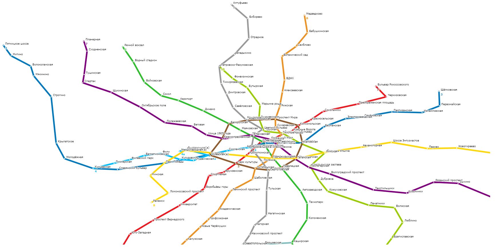

# Transport router
Библиотека для построения маршрутов транспорта с привязкой к геолокации.
Принимает на входе и формирует на выходе JSON.
Позволяет визуализировать карту маршрутов, используя формат SVG.
Осуществляет поиск оптимального по времени маршрута.

Пример построенной карты московского метро:

## Требования:
* C++17 (STL).
